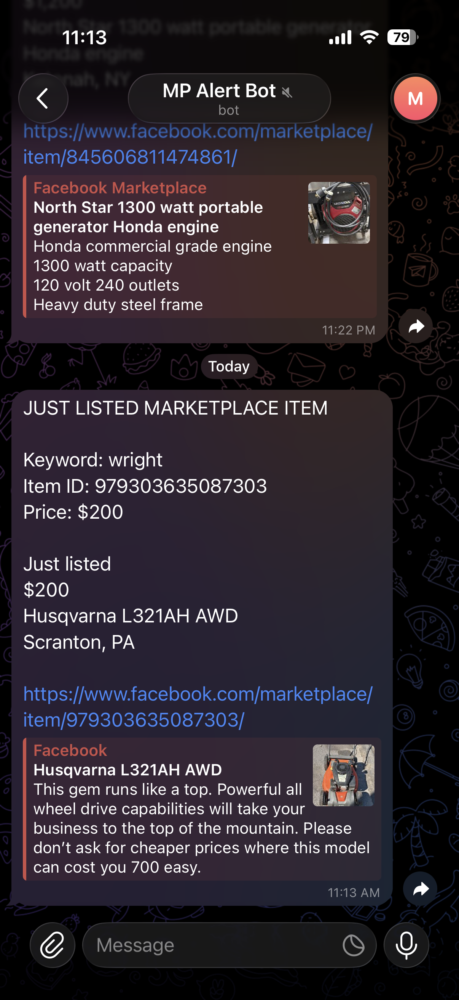
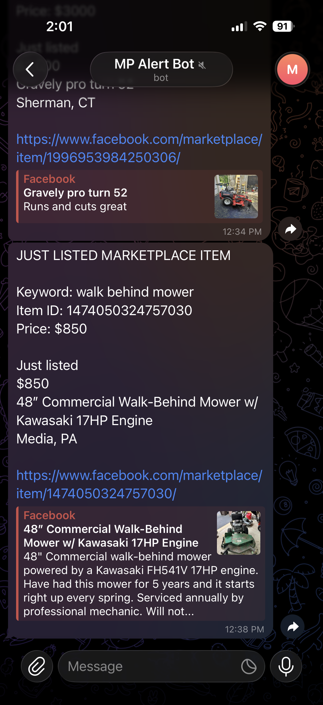

# Facebook Marketplace Monitoring Bot

Facebook Marketplace monitoring bot built with Python, Playwright, and Telegram Bot API.

---

## Overview

This project automates Facebook Marketplace searches and sends Telegram alerts when matching listings are detected.

The bot monitors Marketplace for commercial landscaping equipment, generators, and mowers using predefined keywords and custom filtering logic.

---

## Features

- Automated Facebook Marketplace monitoring
- Persistent Facebook login session
- Multi-keyword search
- Automatic page scrolling
- Telegram notifications
- Multiple Telegram recipients
- Item ID deduplication
- Local listing database (`seen.txt`)
- Price filtering
- "Just Listed" detection
- Duplicate prevention across scans

---

## Technologies Used

- Python
- Playwright
- Telegram Bot API
- Visual Studio Code
- Facebook Marketplace

---

## Workflow

```text
Facebook Marketplace
        ↓
Keyword Search
        ↓
Auto Scroll Results
        ↓
Extract Listing Data
        ↓
Price Filter
        ↓
Just Listed Filter
        ↓
Duplicate Check (Item ID)
        ↓
Telegram Alert
```

---

## Monitored Equipment

- Exmark
- Wright
- Bobcat
- Toro
- John Deere
- Honda Mowers
- Honda Generators
- Walk-Behind Mowers
- Commercial Landscaping Equipment

---

## Key Challenges Solved

### Browser Automation

Implemented Playwright automation for Facebook Marketplace navigation and listing extraction.

### Persistent Authentication

Configured browser profile persistence to avoid repeated Facebook logins.

### Deduplication

Implemented Item ID tracking using local storage to prevent duplicate notifications.

### Telegram Integration

Integrated Telegram Bot API for real-time alert delivery.

---

## Screenshots

### Playwright Installation


### First Browser Automation Test


### Marketplace Monitoring Output


### Project Structure


### Telegram Alert Example 1



### Telegram Alert Example 2



---

## Future Improvements

- Location radius filtering
- Seller rating analysis
- VPS deployment for 24/7 monitoring
- Database storage instead of local text files
- Dashboard and reporting
